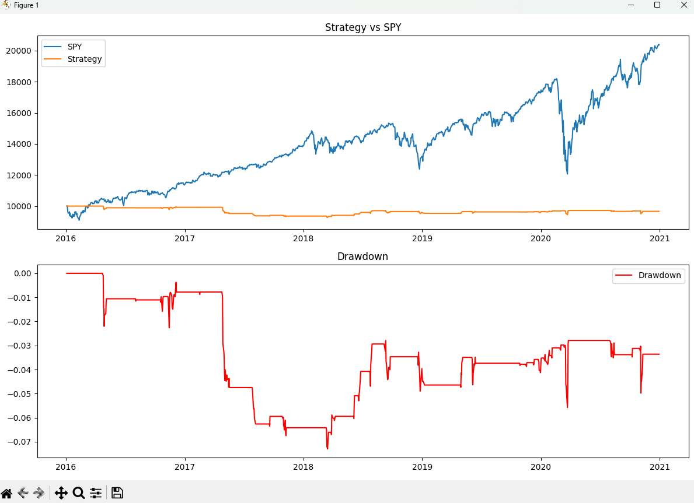

# PairsTradingBot

A statistical arbitrage backtester that identifies cointegrated stock pairs, models mean-reversion signals, and simulates a full trading strategy with performance analytics.

---

## Strategy

Statistical arbitrage exploits the long-term relationship between two cointegrated stocks. Unlike correlation, cointegration means two assets are mathematically tethered — they may drift apart short-term, but always revert to their historical relationship.

The bot computes the spread between two stocks using OLS regression to find the optimal hedge ratio β:

`spread = stock_A - β × stock_B`

When the rolling z-score of the spread exceeds ±2 standard deviations, a signal is generated:
- **z > +2** → Short stock_A, Long stock_B (spread will revert downward)
- **z < -2** → Long stock_A, Short stock_B (spread will revert upward)
- **z → 0** → Exit position

---

## Pipeline

| Module | Description |
|--------|-------------|
| `data.py` | Pulls adjusted closing prices via yfinance, aligns timestamps, drops missing data |
| `cointegration.py` | Runs OLS regression + ADF test to validate pair cointegration (p < 0.05) |
| `spread.py` | Computes hedge ratio, constructs spread, calculates rolling z-score |
| `signals.py` | Generates long/short/flat signals from z-score with lookahead bias prevention |
| `backtest.py` | Simulates trades day-by-day with transaction cost modeling |
| `metrics.py` | Computes performance metrics and plots equity curve vs SPY benchmark |

---

## Results

Tested on **GOOGL/IVV — 2016 to 2020**

| Metric | Value |
|--------|-------|
| Total Return | -3.36% |
| Annualized Return | -0.68% |
| Sharpe Ratio | -0.124 |
| Sortino Ratio | -0.060 |
| Max Drawdown | -7.3% |



> The strategy is market-neutral — it doesn't benefit from bull markets. During 2016–2020 where SPY doubled, the strategy preserved ~96% of capital with significantly lower drawdown than a leveraged position.

---

## How to Run

```bash
git clone https://github.com/akkuya/PairsTradingBot
cd PairsTradingBot
pip install -r requirements.txt
python main.py
```

When prompted, enter two tickers separated by a space:
`Enter the two tickers that you want to run the strategy on: GOOGL IVV`

---

## Tech Stack

- **yfinance** — Historical OHLCV data
- **pandas** — Data manipulation and time series operations
- **statsmodels** — OLS regression and ADF stationarity test
- **numpy** — Vectorized signal generation
- **matplotlib** — Equity curve and drawdown visualization
